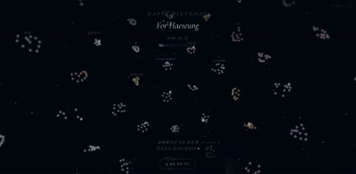
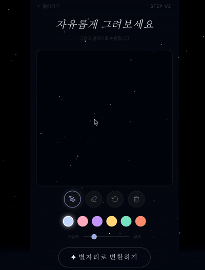
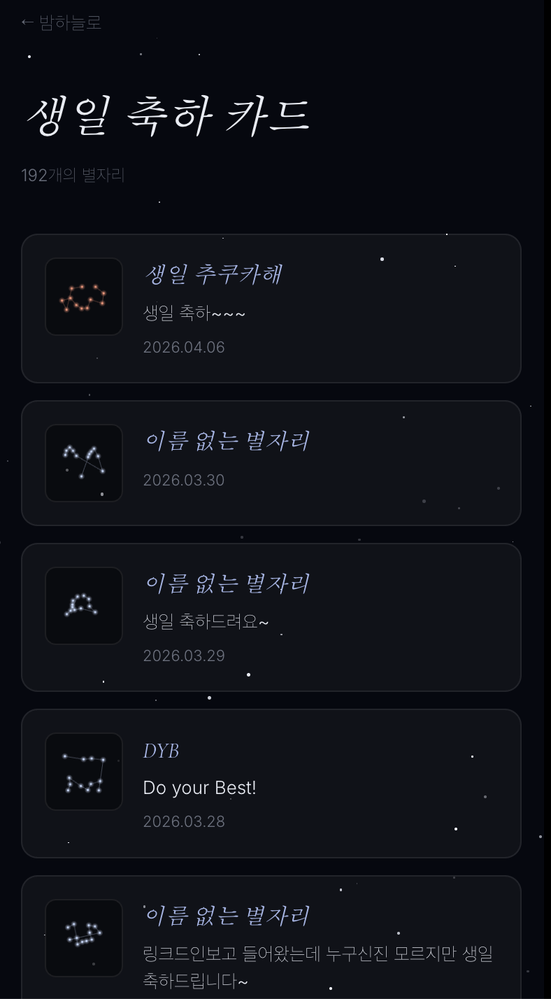

# ✦ 혜승이 생일 밤하늘

> 별자리를 직접 그리면, 그 그림이 별자리로 변환되어 내 밤하늘을 채우는 생일 기념 웹 페이지.

---

## 스크린샷

### 메인 — 밤하늘

<div align="center">
  
</div>

### 별자리 그리기

<div align="center">
  
</div>

### 생일 축하 카드

<div align="center">
  
</div>

---

## 만들게 된 계기

어릴 땐 생일이면 친구들한테 축하 메시지도 보내고 선물도 전달하곤 했었는데, 나이가 들수록 축하는 해주고 싶은데 선물을 주기엔 좀 애매한 관계랄까 — 망설이다 그냥 넘긴 경우가 점점 많아졌어요.

그래서 생일을 맞아, 비슷한 고민을 하는 분들이 **부담 없이 생일 축하를 전할 수 있는 공간**을 만들어봤습니다.

컨셉은 별자리예요. 방문자가 캔버스에 자유롭게 그림을 그리면, 그 그림이 별자리로 변환되어 밤하늘을 채우게 됩니다. 메시지를 남기셔도 되고, 별자리만 남겨주셔도 됩니다.

처음엔 케이크에 초를 꽂는 컨셉으로 시작했다가, 디자인이 까다로워서 방향을 바꿨어요. 우주를 워낙 좋아해서 만드는 내내 너무 즐거웠습니다.

_(저녁 먹다 떠오른 아이디어로 2시간 만에 바이브 코딩으로 만든 사이트예요.)_

---

## 주요 기능

| 화면 | 설명 |
|------|------|
| **밤하늘 (index.html)** | 방문자들이 남긴 별자리들이 실시간으로 하늘에 떠 있음. 음표 버튼을 누르면 생일 노래도 나옴. |
| **별자리 그리기 (draw.html)** | 어두운 캔버스에 자유롭게 그림 → 윤곽선에서 별점 추출 → 별자리로 변환 → 하늘에 등록 |
| **생일 축하 카드 (guestbook.html)** | 등록된 별자리 카드 목록. 카드 탭 시 하늘에서 해당 별자리 하이라이트. |

---

## 기술 스택

- **Three.js** — WebGL 기반 밤하늘 및 별자리 렌더링
- **Canvas API** — 자유 드로잉 및 픽셀 기반 별점 샘플링
- **Firebase Firestore** — 별자리 데이터 실시간 저장/조회
- **Vanilla JS (ES Modules)** — 프레임워크 없이 구현
- **Vercel** — 정적 호스팅 및 배포

---

## 별자리 변환 로직

1. 드로잉 캔버스에서 픽셀 데이터를 읽어 채워진 영역 탐지
2. 윤곽선 위에 약 8~15개 별점을 균등 간격으로 샘플링
3. 샘플링된 좌표를 순서대로 가는 선으로 연결
4. 결과를 Canvas로 렌더링하여 Three.js 씬의 밤하늘에 배치
5. Firestore에 좌표 데이터 저장 → 다른 방문자 화면에 실시간 반영

---

## 로컬 실행

```bash
# 1. 환경변수 설정
cp .env.example .env   # Firebase 키 입력

# 2. firebase-config.js 생성
node build.js

# 3. 로컬 서버 실행
npx http-server -p 8787
# 브라우저에서 http://localhost:8787 접속
```

---

## 디렉토리 구조

```
HB/
├── index.html          # 메인 밤하늘
├── draw.html           # 별자리 그리기
├── guestbook.html      # 생일 축하 카드
├── style.css           # 전역 스타일 (CSS 변수 기반 테마)
├── firebase-config.js  # Firebase 설정 (build.js로 자동 생성)
├── build.js            # .env → firebase-config.js 생성 스크립트
├── vercel.json         # Vercel 배포 설정
└── screenshots/        # README용 스크린샷
```
